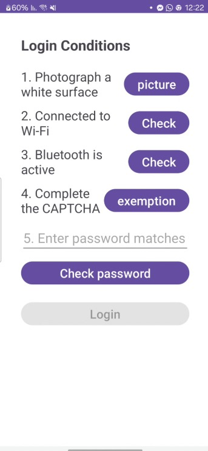

# 🔐 Mobile Login Security App 

This Android app demonstrates a **secure login screen** that requires passing 5 real-time checks before allowing the user to log in.

It was developed as part of a Mobile Security course.

---

## 🖼️ Login Conditions Screen



---

## ✅ Security Conditions (5 checks to login)

The user must meet all of the following conditions before the **Login** button becomes active:

### 1. 📸 Photograph a white surface
- Launches the camera.
- Checks the center region of the image for brightness.
- Approves if enough white pixels are detected (adaptive threshold).

### 2. 📶 Connected to Wi-Fi
- Verifies that the device is connected to a Wi-Fi network using `ConnectivityManager`.

### 3. 🔵 Bluetooth is enabled
- Uses `BluetoothAdapter` to check if Bluetooth is turned on.
- If it's off, a toast prompts the user to enable it.

### 4. 🤖 Human CAPTCHA
- Displays a dialog with three colored buttons.
- The user must tap the **green** one to pass (simple human verification).

### 5. 🔋 Battery % = Password
- The user must enter the current battery level (e.g., "47").
- The value is validated against the actual system battery percentage.

---

## 🔓 Successful Login Screen


Once all 5 conditions are met and the user taps **Login**, they are redirected to a success screen with a confirmation message ✅

---

## 🧠 Technologies Used

- **Java**
- **Android ViewBinding**
- **Camera Intent API**
- **Bluetooth & Wi-Fi Managers**
- **BatteryManager**
- **Sensors API **
- **AlertDialog for CAPTCHA**
- **Material UI Buttons with dynamic tint**
- **Toasts for user feedback**

---

## ⚙️ Permissions Required

```xml
<uses-permission android:name="android.permission.ACCESS_NETWORK_STATE" />
    <uses-permission android:name="android.permission.INTERNET" />
    <uses-permission android:name="android.permission.BLUETOOTH" />
    <uses-permission android:name="android.permission.BLUETOOTH_ADMIN" />
```
---
## **Authors**

- [Gal Deri](https://github.com/galDeri23)
